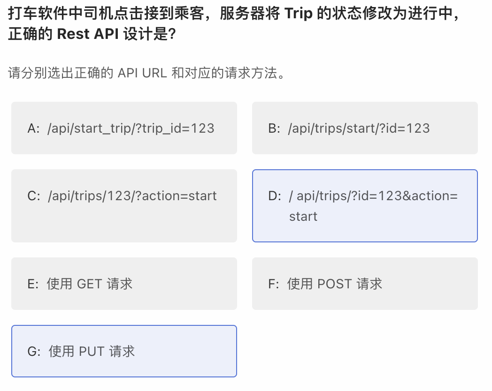

# Chapter 6 网站系统，API设计与短网址

Q:

.png>)

A: A B C D

一般来说界面就算 Framework 给你做了你也不会用，因为每个网站都有自己不同的界面设计需求，因此一般来说 Web Framework 不帮你操心这个事情。 Rest API Framework 一般也是不提供的，因为不是每个开发都会按照这个规范来写代码。\

Q:.png>)

A: A

Q: .png>)

A: A

301=永久 302=暂时 区别是，永久的话，浏览器会记录下这个跳转匹配，然后下次同样的链接就不会再去真正访问网站了，直接跳转。如果是暂时的，就还是会每次都去访问这个网站看一下。

Q: .png>)

A: A

用户向 Web Server 发的请求是 Request Web Server 向

&#x20;Database 发的请求是 Query Database&#x20;

向 Disk 发的请求是 I/O

Q:.png>)

A: B

www.net.cn 是一个 .net.cn 为后缀的域名，而不是一个 .cn 为后缀的域名。意不意外，惊不惊喜！

Q:.png>)

A: D

带了user\_id的选项都不对，因为带了user\_id说明这个url是可以被篡改的，那就可以获得别的user的信息，会泄露他人的资料

Q: .png>)

A: B

Q: .png>)

A: B

timestamp 的精度是微妙级别的，是足够的，一个人的朋友圈里有两个人在同一个 timestamp 发了帖子的概率几乎为0。如果你还是担心 timestamp 的精度不够的话，一个简单的办法是 + 一个随机后缀，如 timestamp 取出来到微妙是 `1554553786168125` 的话，后面填 5 位随机整数如`13234`，凑成 `155455378616812513234`。当然存储的时候类型上得是 bigint 了，因为很大。不可以用 float / double 存储，精度不够。

Q:.png>)

A: C

如果你需要用 Auto-increment ID，就用关系型数据库，否则可以用非关系型数据库，操作更简单一些。

Q:.png>)

A: C D

验证码和激活码没有去重的需求。订单确认码才有去重的需求。

Q:.png>)

A: A

Q:.png>)

A: B

Q:.png>)

A: C

获取的对象主体为 payment，所以应该以 /payments/ 作为根目录，其他信息都作为参数传入。 读请求，所以应该是 GET 而不是 POST

Q:

A:C G

修改的主体是 Trip，所以是 `/api/trips/` 开头。\
因为是对单个 trip 进行修改，所以是 `/api/trips/<trip_id>/`，id 放在 URL 路径里而不是参数里。Rest API 的规则里，被修改的主体的 id 是放在 URL 里的。\
最后修改是 PUT，不是 POST 也不是 GET。

### Problem

232

522

### Other Q\&A

Q: 如果server 回301， client 是不是要通过server的回复再发一条请求？ 还是server应该自己redirect？

A: 是由 client 自己 redirect，而不是 server redirect。

401 vs 403

401 Unauthorized： 该HTTP状态码表示认证错误，它是为了认证设计的，而不是为了授权设计的。收到401响应，表示请求没有被认证—压根没有认证或者认证不正确。（一般在响应头部包含一个WWW-Authenticate来描述如何认证）。通常由web服务器返回，而不是web应用。从性质上来说是临时的东西。（服务器要求客户端重试）

403 Forbidden：该HTTP状态码是关于授权方面的。从性质上来说是永久的东西，和应用的业务逻辑相关联。它比401更具体，更实际。收到403响应表示服务器完成认证过程，但是客户端请求没有权限去访问要求的资源。

总的来说，401 Unauthorized响应应该用来表示缺失或错误的认证；403 Forbidden响应应该在这之后用，当用户被认证后，但用户没有被授权在特定资源上执行操作。
